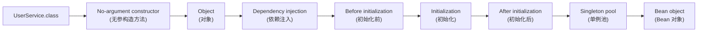

# Bean Lifecycle

> [1. High-Level Overview](#1-high-level-overview)

## 1. High-Level Overview

1. Start with the bean class, such as `UserService.class`.

2. Call the **no-argument constructor (无参构造方法)**.

3. Create the raw **object (对象)**.

4. Perform **dependency injection (依赖注入)**, such as injecting fields marked with `@Autowired`.

5. Run **before initialization (初始化前)** bean post-processors.

6. Run **initialization (初始化)** callbacks, such as `afterPropertiesSet()`.

7. Run **after initialization (初始化后)** bean post-processors, which may return a proxy.

8. Store singleton beans in the **singleton pool (单例池)**. Prototype beans skip this step.

9. Return the final **Bean object (Bean 对象)**.
